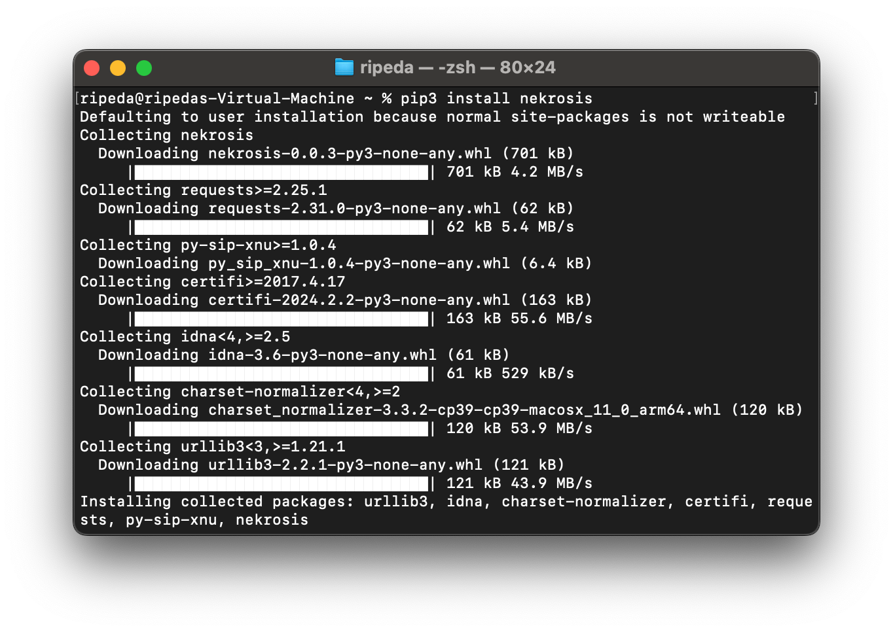

# Python API Installation

Nekrosis is available either through PyPI or GitHub as source code. You can install Nekrosis using either method, depending on your preference.

* [PyPI](#pypi)
* [GitHub Source](#github-source)

### PyPI

::: tip Prerequisite

1. Python 3.6 or newer from [Python.org](https://www.python.org).

:::

First, install Nekrosis through PyPI using the following command:
::: code-group
```shell [Command Line]
python -m pip install nekrosis
```
:::



Now, verify you can import it correctly:

::: code-group
```shell [Command Line]
python3 -c "import nekrosis; print(nekrosis.__version__)"
```
:::

Once you have verified the installation, head to the [Usage](../Usage/api.md) section to learn how to use Nekrosis.


### GitHub Source

::: tip Prerequisite

1. Python 3.6 or newer from [Python.org](https://www.python.org).
2. `git` to clone the repository.
:::

First, clone the repository using the following command:
::: code-group
```shell [Command Line]
git clone https://https://github.com/Nekrosis-ISS-Capstone/Nekrosis.git
```
:::

Next, navigate to the cloned repository and install the required dependencies using the following command:
::: code-group
```shell [Command Line]
cd ./Nekrosis
python -m pip install -r requirements.txt
```
:::

Now, verify you can import it correctly:

::: code-group
```shell [Command Line]
python -c "import nekrosis; print(nekrosis.__version__)"
```
:::

Once you have verified the installation, head to the [Usage](../Usage/api.md) section to learn how to use Nekrosis.