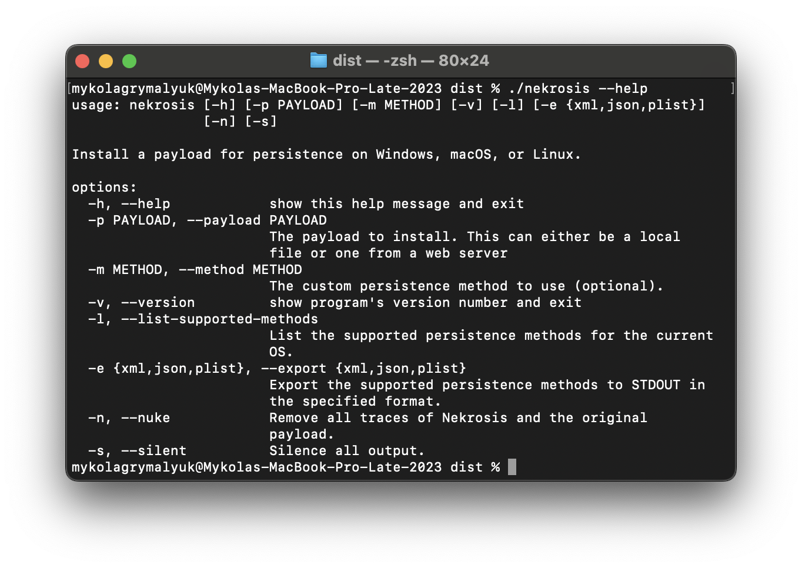

# Command Line Installation

### GitHub download

First, head to the releases tab and view the latest release. From there, download the appropriate binary for your system:

::: details Unsure which binary to download?

- **x86_64**: For Intel/AMD systems, select this if you are unsure.
- **arm64**: For ARM systems, such as Apple's M1 chip.
- ***.whl**: For Python module installation.

:::


### Verification

Once downloaded, head to the directory where the binary is located and run the following command to verify the installation:

::: code-group
```shell [Command Line]
./nekrosis --help
```
:::



::: tip
Ensure the binary is executable by running `chmod +x nekrosis` before running the command.
:::


Once verified, head to the [Usage](../Usage/cli.md) section to learn how to use Nekrosis.